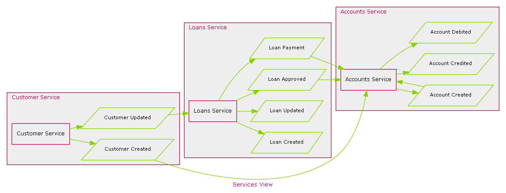
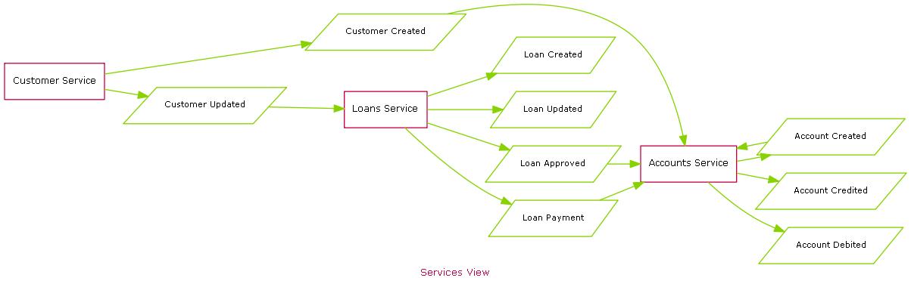

xml-architecture
================

A simple xml representation for message flow architecture 

Sample
===

There is a simple sample provided that shows how the xml representation and the generated output.

Xml 
===

[Source](./doc/Sample/Sample.xml)

```xml
<Architecture>
  <Service name='Customer Service'>
    <Adapter name='Customer Details Application Adapter' application='Customer Details'>
      <Publish>
        <Message name='Customer Created'/>
        <Message name='Customer Updated'/>
      </Publish>
    </Adapter>
  </Service>
  
  <Service name='Loans Service'>
    <Adapter name='Loans Application Adapter' application='Loans'>
      <Publish>
        <Message name='Loan Created'/>
        <Message name='Loan Updated'/>
      </Publish>
      <Subscribe>
        <Message name='Customer Updated'/>
      </Subscribe>
    </Adapter>
    <Adapter name='Loans Approval Application Adapter' application='Loan Approval'>
      <Publish>
        <Message name='Loan Approved'/>
      </Publish>
    </Adapter>
    <Adapter name='Loans Payment Application Adapter' application='Loan Payment'>
      <Publish>
        <Message name='Loan Payment'/>
      </Publish>
    </Adapter>
  </Service>
  
  <Service name='Accounts Service'>
    <Adapter name='Accounts Creation Application Adapter' application='Account Creation'>
      <Publish>
        <Message name='Account Created'/>
      </Publish>
      <Subscribe>
        <Message name='Loan Approved'/>
        <Message name='Customer Created'/>
      </Subscribe>
    </Adapter>
    <Adapter name='Accounts Application Adapter' application='Accounts'>
      <Publish>
        <Message name='Account Credited'/>
        <Message name='Account Debited'/>
      </Publish>
      <Subscribe>
        <Message name='Account Created'/>
        <Message name='Loan Payment'/>
      </Subscribe>
    </Adapter>
  </Service>
</Architecture>

```

Output
===


Services View
===
The Services view show the main services and the messages that are published.

Messages are grouped with the service that publishs them.



Services and messages are shown as groups

