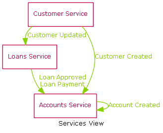
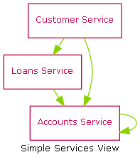
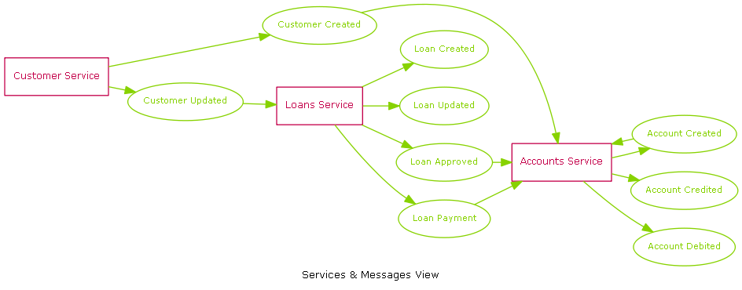

xml-architecture
================

I recently was given a large pub-sub architecture that was very complicated to understand.  

So, I constructed an xml view of the architecture and decided to output the architecture visually using graphviz.

A very simple banking architecture is included here to show some of the outputs that can be created.



Banking Sample
===
Simple banking scenario with 3 Services Customer, Loans and Accounts and some of the messages that flow between them.

Configuration 
===
The xml configuration is pretty easy to understand and can be viewed here: [Source](./doc/Sample/Sample.xml)

```xml
<Architecture>
  <Service name='Customer Service'>
    <Adapter name='Customer Details Application Adapter' application='Customer Details'>
      <Publish>
        <Message name='Customer Created'/>
        <Message name='Customer Updated'/>
      </Publish>
    </Adapter>
  </Service>
  
  <Service name='Loans Service'>
    <Adapter name='Loans Application Adapter' application='Loans'>
      <Publish>
        <Message name='Loan Created'/>
        <Message name='Loan Updated'/>
      </Publish>
      <Subscribe>
        <Message name='Customer Updated'/>
      </Subscribe>
    </Adapter>
    <Adapter name='Loans Approval Application Adapter' application='Loan Approval'>
      <Publish>
        <Message name='Loan Approved'/>
      </Publish>
    </Adapter>
    <Adapter name='Loans Payment Application Adapter' application='Loan Payment'>
      <Publish>
        <Message name='Loan Payment'/>
      </Publish>
    </Adapter>
  </Service>
  
  <Service name='Accounts Service'>
    <Adapter name='Accounts Creation Application Adapter' application='Account Creation'>
      <Publish>
        <Message name='Account Created'/>
      </Publish>
      <Subscribe>
        <Message name='Loan Approved'/>
        <Message name='Customer Created'/>
      </Subscribe>
    </Adapter>
    <Adapter name='Accounts Application Adapter' application='Accounts'>
      <Publish>
        <Message name='Account Credited'/>
        <Message name='Account Debited'/>
      </Publish>
      <Subscribe>
        <Message name='Account Created'/>
        <Message name='Loan Payment'/>
      </Subscribe>
    </Adapter>
  </Service>
</Architecture>

```

Output
===
The output from the tool is a set of PNG files generated using GraphViz.

Services View
===
The Services view show the main services and the messages that are published.

Simple Services View shows the connections between the services (but not the messages)



Services View shows the connections between the services and the names of the messages


Services and Messages view shows the services and messages as nodes.




Adapter Views
===
Soon...

Messages Views
===
Soon...


I am not sure if xml-architecture is the right name for this.... will have to think up a better one soon.
